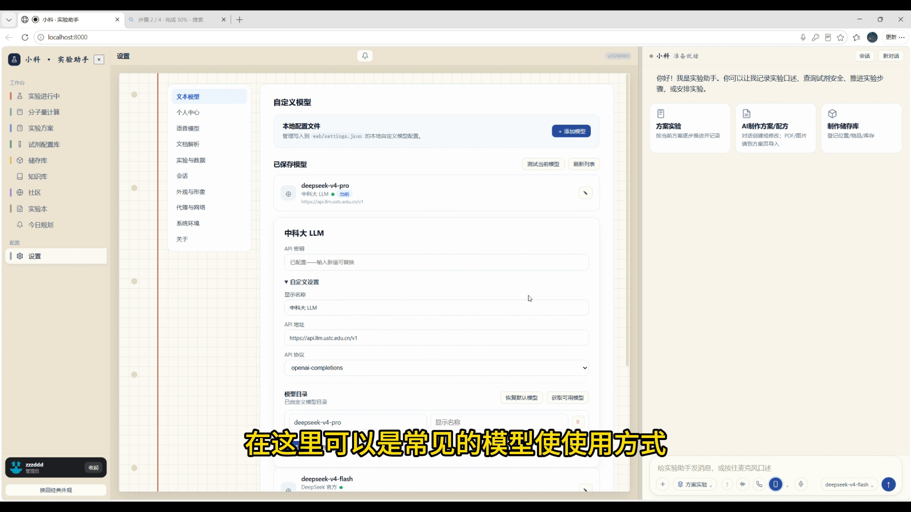
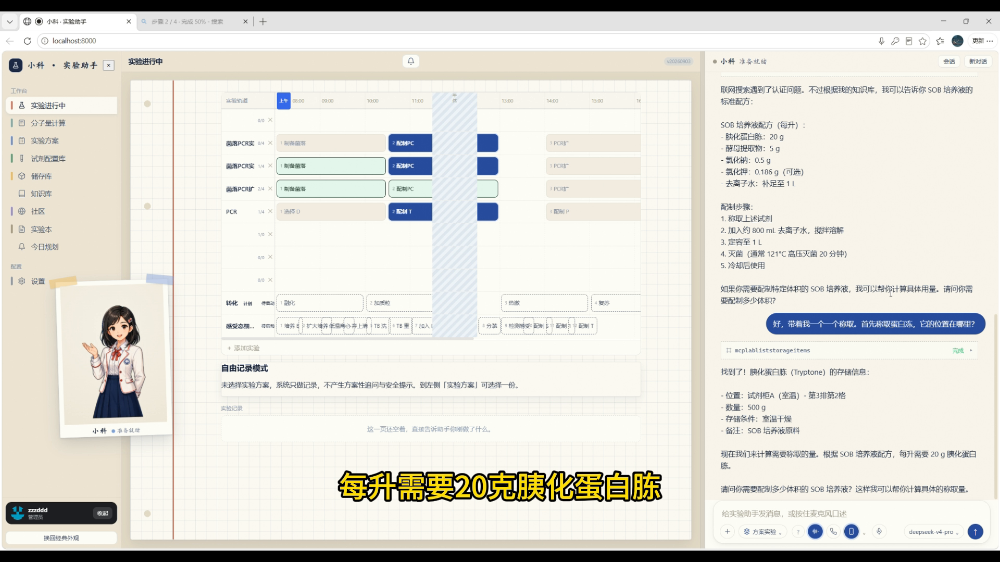
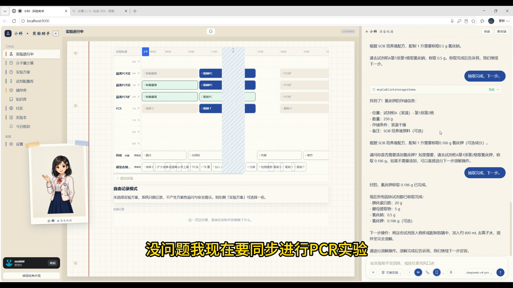
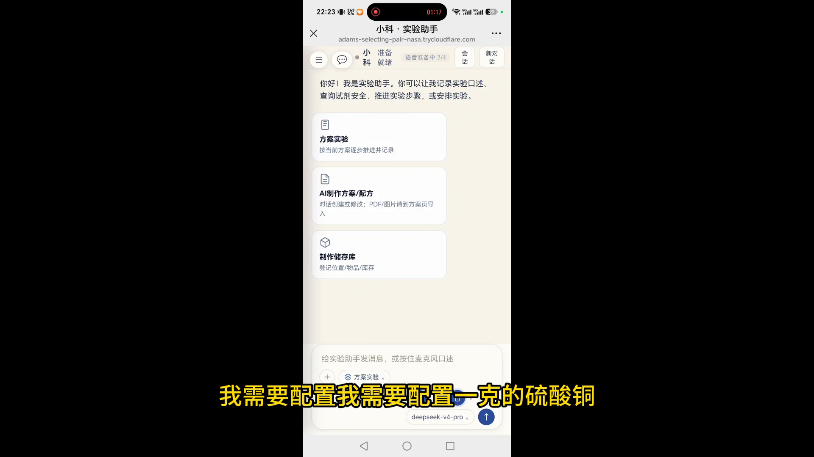
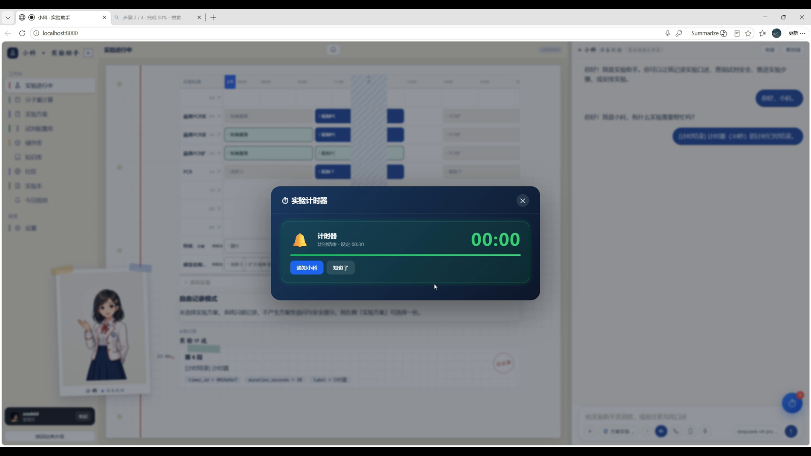

# 小科智能实验助手 · Xiaoke Lab

> **实验台上的全双工 AI 搭档——边做边说，它替你记、算、查、盯。**
> *Your voice-first AI lab partner — talk while you work; it records, calculates, searches and watches the clock for you.*

[](LICENSE)

---

## 截图 / Screenshots

<p align="center">
  
  
  
</p>

<p align="center">
  
  
</p>

---

## 它是什么 / What is it

高校实验室里，操作者经常双手被占用、注意力集中、设备与材料分散。传统记录要求频繁拿手机或电脑，容易漏掉实际温度、时长、质量、观察现象；已有方案常以 PDF/图片存在，难以直接执行。

小科把这些摩擦统一成一条**可追踪的 Protocol 生命周期**：

```
发现/导入方案 → 适配本地设备与材料 → 语音边做边记 → 产物自动入库 → 复盘与溯源
```

**核心价值一句话：让实验人员把精力放在"做实验"上，而不是"记实验"上。**

*In real labs, your hands are full, your eyes are on the bench, and stopping to type breaks the flow. Xiaoke turns every experiment into a traceable Protocol lifecycle — from protocol import, voice recording while you work, automatic product storage, to evening review and full provenance.*

---

## 核心能力 / Highlights

| 能力 | 说明 |
|------|------|
| 🎙️ **全双工实时语音** | Qwen Audio 全双工模型，听的同时可以回答，随时可打断（barge-in）；进入页面即自动聆听，无需手动开始 |
| 💗 **主动心跳** | 每天早上自动检查库存过期/即将过期、今日实验计划、昨日工作摘要，有值得打扰的内容才推送；晚上自动生成今日总结与明日建议 |
| 🧬 **产物生命周期** | 口述 → 结构化事件 → 产物自动登记入库 → 一路溯源到来源实验与原始口述；今天的产物是下一个实验的原料 |
| 🧠 **自研 Agent Harness** | Context Engine 组装上下文，EmbeddedAgentRunner 多轮工具循环，MultiAgentRouter 路由心跳/反思子智能体 |
| 🔌 **55+ 插件式工具** | 计算、试剂配制、计时、知识库、储存库、方案编辑、任务与通知，统一协议注册，按场景动态注入 |
| 📚 **知识库检索** | 实验室共享表格（引物表/抗体表/细胞系表）上传即检索，多关键词 AND 匹配；检索无命中明确拒答，不编造 |
| 📱 **双端覆盖** | 桌面 Web 完整工作台 + 手机流程卡（实时语音、计时器横条、心跳/反思推送、二维码访问），同一服务端单一事实源 |
| 🕐 **计时器** | 语音启动"离心 10 分钟"，到点铃铛动画 + 三声提示音 + 自动通知 AI 推进 |
| 📦 **便携部署** | 便携式 Windows EXE 内置 Python 环境、网页资源与离线语音模型，首次运行自动生成证书与数据库 |
| 🔍 **执行留痕** | 统一 trace_id 贯穿意图判定 → 工具选择 → 检索 → 生成 → 降级，写 JSONL；bad case 30 秒内按 trace 一键回放 |
| 🛡️ **工具调用兜底** | 工具名白名单、schema 校验、超时重试熔断、全局步数上限——模型给出坏工具名系统不崩、不无限循环 |

---

## 技术主张 / Design Philosophy

> **模型负责理解与建议，程序负责状态、权限与落盘；每个建议可校验，每个事实有来源。**
> *Models propose; programs decide. Every suggestion is verifiable, every fact has provenance.*

这是小科与"聊天机器人套壳"的本质区别。具体体现在：

- **确定性状态机**：步骤"做没做完、数据对不对、该不该追问"由程序判定，模型不能直接把步骤标绿。
- **原始记录优先**：模型的结构化推断永不覆盖原始口述；结构化失败时如实提示，不谎称"已记录"。
- **降级保真**：模型超时或不可用时，原始口述先落盘，规则抽取继续处理明确数字、单位、温度和时长。
- **工具即合同**：工具发现、参数校验与权限检查由程序裁决，模型只负责提出理解与调用建议。

---

## 架构 / Architecture

```text
┌────────────────────────────────────────────────────────────┐
│  交互层：桌面 Web（三列工作台）+ 手机流程卡 + 终端语音         │
└──────────────────────────┬─────────────────────────────────┘
                           │ HTTP / SSE / WebSocket
┌──────────────────────────▼─────────────────────────────────┐
│  智能体层：Agent Harness                                    │
│  Context Engine（今日计划/工作摘要/库存/主人画像）            │
│  EmbeddedAgentRunner（多轮工具循环，上限 12 步）              │
│  MultiAgentRouter（心跳 / 反思子智能体路由）                  │
│  Terminal Tools（heartbeat_respond / reflection_respond）    │
└──────────────────────────┬─────────────────────────────────┘
                           │ 工具名白名单 / schema 校验 / 超时重试熔断
┌──────────────────────────▼─────────────────────────────────┐
│  能力层：55+ 插件式工具                                      │
│  计算 · 试剂 · 计时 · 知识库 · 储存库 · 方案编辑 · 通知        │
│  唤醒 · VAD · SenseVoice/FunASR · TTS · LLM · RAG           │
└──────────────────────────┬─────────────────────────────────┘
                           │
┌──────────────────────────▼─────────────────────────────────┐
│  数据层：SQLite + JSONL                                     │
│  会话 · 原始口述 · 结构化事件 · 版本 · 审计记录 · trace.jsonl   │
└─────────────────────────────────────────────────────────────┘
```

---

## 快速开始 / Quick Start

### Windows（普通用户）

1. 安装 Python 3.11 64 位（勾选 `Add python.exe to PATH`）
2. 双击仓库根目录 `start.bat`
3. 首次运行自动创建虚拟环境、安装依赖；API 密钥在网页右上角「设置」中填写

### 便携版（无需 Python）

下载 Release 中的 `AI107LabAssistant.exe`，双击运行，首次启动自动生成本机证书、配置和数据库。

### 📖 第一次用？

看这份给实验室同学的 [5 分钟试用说明](docs/TRIAL_GUIDE.md)：装什么、怎么开始、第一次该说什么、常见问题都写好了。

### 评测与调试（开发者）

```bash
# bad case 回放：按 trace_id 打印完整链路
python -m scripts.trace_show --list
python -m scripts.trace_show <trace_id>

# 固定回归集 + 运行统计：任务成功率 / 工具正确率 / 平均步数 / P50 时延 / token / 降级率
python -m scripts.eval_report
```

---

## 项目结构 / Structure

```text
web/                          # 服务端与前端
  agent/                      # Agent 核心（run_agent / stream_agent / 工具兜底 / 埋点）
    core.py                   # INSTRUCTIONS + 工具循环 + 白名单/schema/超时/熔断
  agent_harness.py            # 心跳 / 反思循环（Context Engine + Router + Terminal Tools）
  agent_loop.py               # EmbeddedAgentRunner + MultiAgentRouter
  harness_context.py          # 分层上下文组装（方案状态/实验状态/试剂流程/活跃实验）
  compaction.py               # 超长会话压缩（摘要 + 保留最近 tail）
  tool_router.py              # 按场景动态注入工具（核心常驻 + skill 组按需加载）
  lab_tools.py                # 55+ 插件式工具注册与执行
  tracing.py                  # trace.jsonl 留痕（trace_id 贯穿全链路）
  api/                        # FastAPI 路由（agent/chat/kb/protocols/papers/...）
  database/                   # SQLite 持久化（会话/知识库/论文库/储存库）
  frontend/                   # 原生 JS 前端（三列工作台 + 手机流程卡）
scripts/                      # 开发与评测脚本
  trace_show.py               # bad case 回放
  eval_report.py              # 固定回归集报告
docs/                         # 文档与截图
```

---

## English Summary

**Xiaoke Lab** is a voice-first AI assistant for wet-lab researchers. It combines:

- **Full-duplex realtime voice** (Qwen Audio) with barge-in — you talk, it listens, and you can interrupt anytime.
- **A proactive Agent Harness** with a daily 8:00 heartbeat (inventory check, expired reagents, today's plan) and an evening reflection that summarizes the day and suggests tomorrow's work.
- **Full product lifecycle** — from spoken observation to structured event, to product registration in storage, to provenance tracing back to the source experiment. Today's product becomes tomorrow's raw material.
- **55+ plugin-style tools** — calculation, reagent prep, timers, knowledge base, storage, protocol editing, scheduling — registered under one protocol and injected by context.
- **Dual clients** — desktop web workbench + mobile flow cards — sharing one source of truth.
- **Portable Windows EXE** — Python runtime, web assets, and offline speech models bundled; first run generates certs, config, and database.
- **Execution tracing** — every turn gets a trace_id written to JSONL; `python -m scripts.trace_show <trace_id>` replays any bad case in seconds.
- **Tool-call guardrails** — tool-name whitelist, schema validation, timeout/retry/circuit-breaking, and a global step cap. Bad model output never crashes the loop.

**Design principle:** *Models propose; programs decide. Every suggestion is verifiable, every fact has provenance.*

---

## 开源说明 / License

本项目采用 **Apache License 2.0**。设计上参考了 [OpenClaw](https://github.com/openclaw/openclaw)（MIT License）的 agent loop、compaction 与多智能体路由思想，在此致谢。

第三方依赖的许可证见各自项目：FastAPI（MIT）、PyMuPDF（AGPL-3.0 / 商业双许可）、openpyxl（MIT）、OpenAI SDK（Apache-2.0）。

### 第三方数据许可

`data/protocols/external/raw/` 下的外部实验方案抓取自 [protocols.io](https://www.protocols.io/)，均为 **Creative Commons Attribution (CC BY)** 许可。每份方案的原始 URL、作者、DOI 与许可证核验说明见 [`data/protocols/external/LICENSE_LEDGER.md`](data/protocols/external/LICENSE_LEDGER.md)。**使用这些数据时请保留原作者署名。**

仓库内其余知识库数据（试剂安全库、配方库、试剂目录）为本项目整理，随 Apache-2.0 授权。

---

## 责任边界 / Disclaimer

小科定位为实验过程中的记录、规划、检索与提醒助手，不替代实验室 SOP、教师指导或安全责任人。涉及危险操作、方案变更与关键写入时，系统保留来源、版本与人工确认。

*Xiaoke is a recording, planning, retrieval and reminder assistant for lab work. It does not replace lab SOPs, instructor guidance, or safety officers. For hazardous operations, protocol changes, and critical writes, the system preserves source, version, and human confirmation.*
